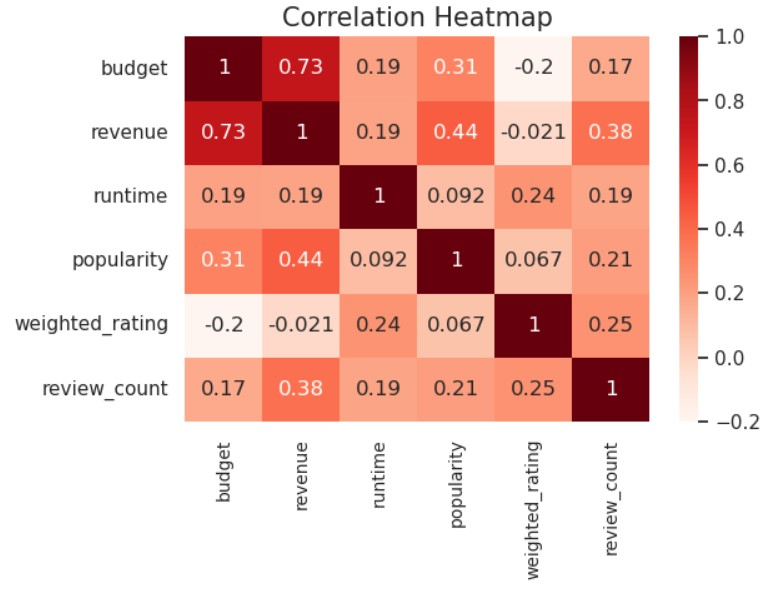
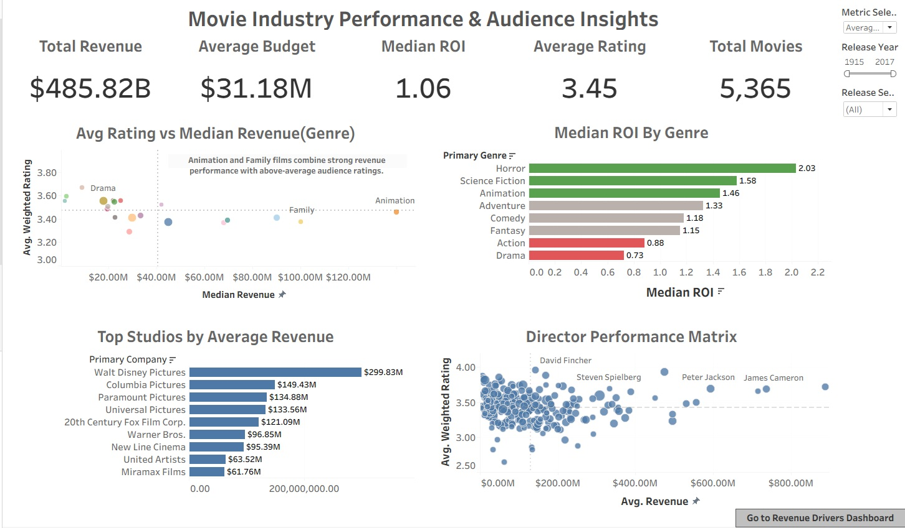
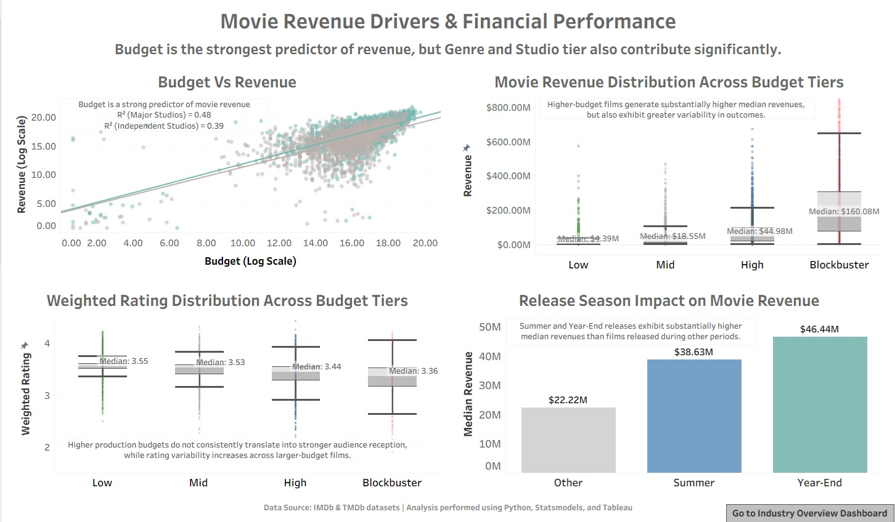

# 🎬 Movie Industry Analytics: Revenue Drivers and Audience Reception
### A Statistical Deep Dive into the Movie Industry | Python & Tableau

    

---

## 📌 Project Overview

This end-to-end data analytics project investigates **what factors drive a movie's financial performance and audience reception** using a dataset of 42,000+ movies sourced from TMDb and GroupLens. The analysis spans the full analytics pipeline — data engineering, statistical testing, regression modeling, and interactive Tableau dashboards — to surface actionable insights for the movie industry.

**Key Question:** *What factors influence a movie's financial performance and audience reception?*

---

## 📁 Repository Structure

```
movie-analytics/
│
├── notebooks/
│   ├── data_cleaning_and_feature_engineering.ipynb
│   ├── EDA_and_statistical_analysis.ipynb
│   
├── reports   
│   ├── Movie_Industry_Analytics.pdf
│
├── data/
│   ├── cleaned_dataset.csv         # Excluded from Repository (Size Limit)
│   └── financial_dataset.csv       
│  
├── charts/ 
│     ├── genre_revenue.png
│     └── genre_rating.png
│     └── median_roi.png
│     └── correlation_heatmap.png   
│ 
├── dashboards/     
│     ├── industry_performance.png
│     └── revenue_drivers.png
│ 
├── tableau/    
│    ├── Movie_Industry_Analytics.twbx
│                 
└── README.md
```

---

## 🗃️ Dataset

| Source | File | Rows | Key Features |
|---|---|---|---|
| TMDb / Kaggle | `movies_metadata.csv` | 45,466 | budget, revenue, popularity, genres, studios |
| GroupLens | `ratings.csv` | 26M | userId, movieId, rating |
| TMDb | `credits.csv` | 45,504 | director, cast (JSON) |
| GroupLens | `links.csv` | 45,843 | movieId ↔ tmdbId bridge |

**Output datasets after cleaning:**
- `cleaned_dataset.csv` — 42,329 movies for EDA and hypothesis testing
- `financial_dataset.csv` — 5,365 movies with non-zero budget & revenue for regression and ROI

---

## 🔧 Data Cleaning & Feature Engineering

**Cleaning steps:**
- Parsed nested JSON columns (`genres`, `production_companies`, `crew`) using `ast.literal_eval` to extract `primary_genre`, `primary_company`, and `director`
- Aggregated 26M individual ratings into per-movie `avg_rating` and `review_count`
- Corrected dtypes, imputed missing `runtime` with column median, and dropped nulls in critical fields
- Merged all four source files via the `links` bridge table; removed duplicates by retaining the highest-popularity record per movie

**Engineered features:**

| Feature | Description |
|---|---|
| `budget_tier` | Quartile-based segmentation: Low / Mid / High / Blockbuster |
| `studio_tier` | Major Studio (≥5 films) vs Independent Studio |
| `release_season` | Summer / Year-End / Other |
| `ROI` | `(Revenue − Budget) / Budget`; winsorized at 1st–99th percentile |
| `log_budget / log_revenue` | Log transforms for regression stability |
| `weighted_rating` | Bayesian-style score: `WR = (v/(v+m))·R + (m/(v+m))·C` |

---

## 📊 Exploratory Data Analysis

### Genre Performance: Revenue vs Audience Reception


**Key Insights:**
- **Animation** ($245.7M), **Family** ($170M), and **Adventure** ($146.8M) dominate box office revenue but show only moderate audience ratings — reflecting broad commercial appeal over critical acclaim
- **Western** (3.75), **Documentary** (3.65), and **War** (3.60) lead on audience ratings despite generating low revenues — confirming that **financial success and audience appreciation do not reliably align**
- **Romance** and **Thriller** stand out as balanced performers, combining above-median revenue with above-average ratings

---

### Genre Efficiency: Which Genres Deliver the Best ROI?


**Key Insights:**
- **Horror** (2.03x) and **Family** (1.83x) are the most capital-efficient genres — Horror's structurally low budgets make it the single strongest ROI play in the dataset
- **Action** (0.88x) and **Drama** (0.73x) fall below breakeven at the median, revealing a fundamental trade-off: the genres that dominate box office headlines consume budgets too large to recover efficiently
- **War** (0.015x) and **Mystery** (0.32x) carry the highest financial risk

---

### Variable Correlation Analysis



**Key Insights:**
- **Budget–Revenue** share the strongest relationship (r = 0.73) — a commercial driver, not a creative one; also flags multicollinearity risk in regression
- **Popularity** is a meaningful independent revenue predictor (r = 0.44) beyond budget alone
- **Weighted rating** is largely decoupled from financial variables (r = −0.021 with revenue; r = −0.20 with budget), confirming that the two success dimensions warrant separate modeling

---

### Top Directors and Studios

**Top 5 Directors (top-quartile ratings, ranked by revenue):**

| Director | Avg Revenue | Avg Weighted Rating |
|---|---|---|
| Peter Jackson | $593.5M | 3.69 |
| Steven Spielberg | $323.6M | 3.61 |
| David Fincher | $213.9M | 3.72 |
| Martin Scorsese | $115.7M | 3.76 |
| Francis Ford Coppola | $85.9M | 3.68 |

- **David Fincher** is the standout value director — commercially strong *and* audience-approved
- Rating variance is surprisingly narrow (3.61–3.76); revenue becomes the true differentiator once directors clear the top-quartile threshold

**Top 5 Studios by Revenue:**

| Studio | Avg Revenue | Avg Rating |
|---|---|---|
| Walt Disney Pictures | $356.4M | 3.40 |
| Summit Entertainment | $214.4M | 3.40 |
| DreamWorks SKG | $202.3M | 3.42 |
| Village Roadshow Pictures | $188.4M | 3.30 |
| Columbia Pictures | $162.3M | 3.36 |

---

### Audience Ratings Across Budget Tiers

The analysis reveals an **inverse relationship** between production budget and audience ratings — low-budget films consistently outperform higher-budget films on median weighted ratings. Budget size increases rating variability more than it guarantees quality, directly challenging the assumption that larger investments lead to better audience outcomes.

---

## 🧪 Hypothesis Testing

### Financial Success Tests

**1. Budget Tier vs Revenue — One-Way ANOVA**

| | Result |
|---|---|
| H₀ | No significant difference in mean revenue across budget tiers |
| F-statistic | 727.18 |
| p-value | < 0.001 |
| Decision | **Reject H₀** |

Tukey HSD post-hoc confirmed all pairwise comparisons are significant — every step up in budget tier yields a statistically meaningful revenue increase.

---

**2. Release Season vs Revenue — One-Way ANOVA**

| | Result |
|---|---|
| H₀ | No significant difference in mean revenue across release seasons |
| F-statistic | 37.63 |
| p-value | < 0.001 |
| Decision | **Reject H₀** |

Post-hoc: Summer and Year-End both significantly outperform off-peak releases; the gap *between* Summer and Year-End is not statistically significant (p = 0.424).

---

### Audience Reception Tests

**3. Studio Type vs Weighted Ratings — Welch's t-test**

| Studio Type | Mean Weighted Rating |
|---|---|
| Independent Studios | 3.49 |
| Major Studios | 3.39 |

| | Result |
|---|---|
| T-statistic | −7.05 |
| p-value | < 0.001 |
| Decision | **Reject H₀** |

Independent studios produce films that receive **statistically higher audience ratings** than major studios, despite generating significantly lower revenues.

---

**4. Genre vs Weighted Ratings — One-Way ANOVA**

| | Result |
|---|---|
| F-statistic | 33.47 |
| p-value | < 0.001 |
| Decision | **Reject H₀** |

Tukey HSD post-hoc: Drama and Crime receive significantly higher ratings than Horror, Fantasy, Science Fiction, and Thriller. Many genre pairs overlap, indicating that genre is a meaningful but not deterministic driver of audience reception.

---

## 📈 Regression Analysis

### Simple Linear Regression — Budget → Revenue

Both variables were log-transformed to address right-skew and improve OLS assumption compliance.

**Model:** `log(Revenue) = 2.3997 + 0.882 · log(Budget)`

| Metric | Value |
|---|---|
| Coefficient (log_budget) | 0.882 |
| R² | 0.493 |
| 95% CI | [0.858, 0.906] |
| p-value | < 0.001 |

A 1% increase in production budget is associated with a ~0.88% increase in revenue. Budget alone explains 49.3% of revenue variation.

All four OLS assumptions verified: linearity (Pearson r = 0.70 on log-log), normality (Q-Q plot — minor tail deviations expected in box office data), homoscedasticity (residuals vs fitted plot shows consistent spread), and independence (each movie's revenue is independent).

---

### Multiple Linear Regression — Budget + Genre + Studio Tier → Revenue

**Model:** `log(Revenue) = 2.74 + 0.820·log(Budget) + Genre Effects + 0.776·(Major Studio)`

| Variable | Coefficient | p-value | Interpretation |
|---|---|---|---|
| log_budget | 0.820 | < 0.001 | Dominant predictor; 0.82% revenue lift per 1% budget increase |
| Studio Tier (Major) | 0.776 | < 0.001 | Major studios → ~117% higher expected revenue vs independents |
| Animation | 0.640 | < 0.001 | ~90% higher revenue vs Drama baseline |
| Horror | 0.582 | < 0.001 | ~79% higher revenue vs Drama baseline |
| Adventure | 0.506 | < 0.001 | ~66% higher revenue vs Drama baseline |
| Science Fiction | 0.450 | 0.011 | ~57% higher revenue vs Drama baseline |

**Model comparison:**

| Model | Predictors | Adj. R² |
|---|---|---|
| Simple Linear | log_budget | 0.493 |
| Multiple Linear | log_budget + Genre + Studio Tier | **0.511** |

The inclusion of genre and studio tier adds meaningful predictive power. VIF values for all predictors were well below 5, confirming no multicollinearity concern.

---

## 📊 Tableau Dashboards

### Dashboard 1 — Industry Performance & Audience Insights



An executive-level overview consolidating the core EDA findings into a single interactive view. Features include:
- **KPI strip** — Total Revenue ($485.82B), Avg Budget ($31.18M), Median ROI (1.06), Avg Rating (3.45), Total Movies (5,365)
- **Avg Rating vs Median Revenue by Genre** — scatter plot surfacing the Animation/Family high-revenue vs Drama high-rating divergence
- **Median ROI by Genre** — bar chart confirming Horror (2.03) as the most capital-efficient genre
- **Top Studios by Avg Revenue** — Walt Disney Pictures leads at $299.83M
- **Director Performance Matrix** — dual-axis scatter mapping average revenue vs weighted rating per director
- **Interactive filters** — release year slider and release season dropdown

---

### Dashboard 2 — Movie Revenue Drivers & Financial Performance



A focused view directly supporting the regression and hypothesis testing findings:
- **Budget vs Revenue (Log Scale)** — overlaid trend lines for Major Studios (R² = 0.48) vs Independent Studios (R² = 0.39)
- **Revenue Distribution Across Budget Tiers** — median revenues: Low $4.39M → Mid $18.55M → High $44.98M → Blockbuster $160M
- **Weighted Rating Distribution Across Budget Tiers** — near-flat medians (3.55 → 3.53 → 3.44 → 3.36), visually confirming budget scales revenue but not audience approval
- **Release Season Impact** — median revenues: Other $22.22M | Summer $38.63M | Year-End $46.44M

---

## 💡 Summary of Key Findings

| Dimension | Finding |
|---|---|
| **Revenue driver** | Budget is the single strongest predictor (R² = 0.51 in MLR), but not a creativity proxy |
| **Studio effect** | Major studio releases generate ~117% more revenue than independent films after controlling for budget and genre |
| **Genre — revenue** | Animation, Family, Adventure lead on raw revenue |
| **Genre — ROI** | Horror (2.03x) and Family (1.83x) are the most capital-efficient genres |
| **Timing** | Summer and Year-End windows yield 70–110% more revenue than off-peak releases |
| **Audience ratings** | Virtually no relationship with revenue (r = −0.02); independent films and narrative genres consistently rate higher |

---

## ✅ Business Recommendations

**To maximize box office revenue:** Invest in Animation, Family, and Adventure; leverage major studio distribution networks; target Summer or Year-End release windows.

**To maximize ROI:** Prioritize Horror and Documentary — both deliver strong capital efficiency through lean production costs and consistent demand.

**To maximize audience satisfaction:** Focus on Drama, Crime, and Mystery with strong creative leadership. Ratings are driven by genre and storytelling quality, not budget scale — independent productions frequently outperform major studios on this dimension.

**On release strategy:** Since Summer and Year-End windows deliver statistically comparable revenues, allocate release dates based on competitive landscape and production readiness rather than season alone.

---

## 🛠️ Tech Stack

| Tool | Purpose |
|---|---|
| Python (pandas, numpy) | Data cleaning, feature engineering, EDA |
| statsmodels | OLS regression, ANOVA, Tukey HSD |
| scipy | Welch's t-test |
| matplotlib / seaborn | Python visualizations |
| Tableau Desktop | Interactive dashboards |

---

## 👤 Author

**Vishal Agrawal** | [LinkedIn](https://linkedin.com/in/) | [GitHub](https://github.com/)

*Dataset: [The Movies Dataset — Kaggle (rounakbanik)](https://www.kaggle.com/datasets/rounakbanik/the-movies-dataset) | Source: TMDb & GroupLens*
